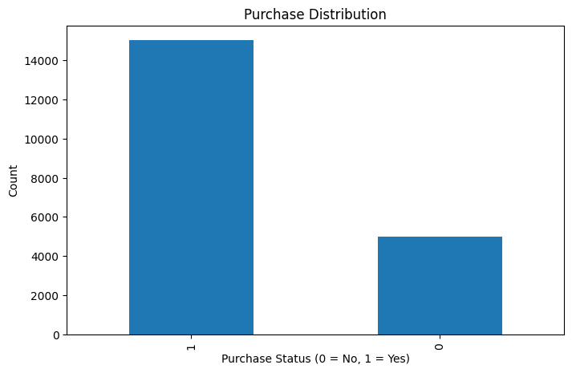
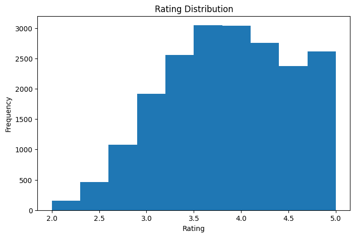
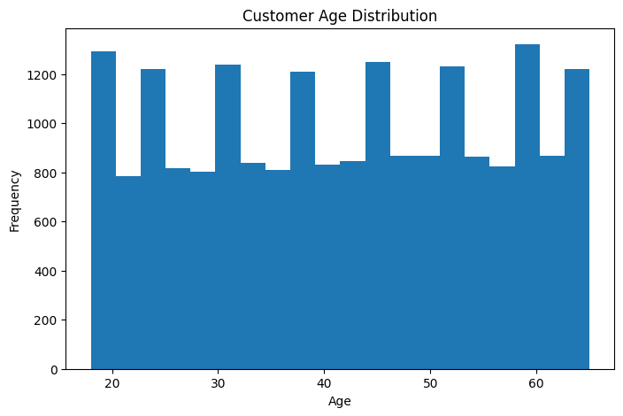
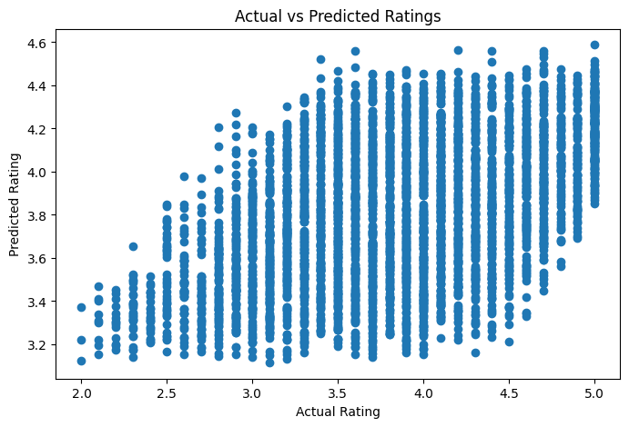
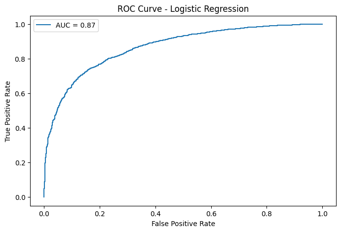

# E-Commerce Recommendation System Using Machine Learning

## Name
Nandini G40 AI & ML

# 1. Introduction

This project focuses on developing an intelligent E-Commerce Recommendation System using Machine Learning techniques.

The system analyzes customer browsing behavior, purchase history, product ratings, and customer information to provide personalized recommendations and business insights.

The project implements:

- Regression for rating prediction
- Classification for purchase prediction
- Clustering for customer segmentation
- Hyperparameter optimization for improving model performance

# 2. Objectives

The objectives of this project are:

- Predict customer ratings using regression.
- Predict purchase likelihood using classification.
- Segment customers based on shopping behavior.
- Optimize machine learning models.
- Evaluate model performance using suitable metrics.

# 3. Dataset Description

The dataset contains customer and product information.

Features include:

- User_ID
- Product_ID
- Category
- Price
- Rating
- Browsing_Time
- Previous_Purchases
- Cart_Addition
- Purchase_Status
- Age
- Gender
- Location
- Discount_Applied
- Total_Spending

# 4. Data Preprocessing

The following preprocessing steps were performed:

- Checked missing values.
- Removed duplicate records.
- Selected important features.
- Applied feature scaling.
- Split dataset into training and testing data.

# 5. Exploratory Data Analysis

## Purchase Distribution

## Rating Distribution

## Customer Age Distribution

# 6. Regression Model - Rating Prediction

Algorithm Used:

Linear Regression

Target Variable:

Rating

Evaluation Metrics:

| Metric | Value |
|---|---|
| MAE | 0.503 |
| RMSE | 0.589 |
| R2 Score | 0.228 |

Actual vs Predicted Ratings:

# 7. Classification Model - Purchase Prediction

Algorithm Used:

Logistic Regression

Evaluation Metrics:

| Metric | Value |
|---|---|
| Accuracy | 82.4% |
| Precision | 85.8% |
| Recall | 91.6% |
| F1 Score | 88.6% |
| ROC-AUC | 73.3% |

Confusion Matrix:

ROC Curve:

# 8. Customer Segmentation

Algorithm Used:

K-Means Clustering

Number of Clusters:

4

Evaluation:

- Inertia
- Silhouette Score
- Elbow Method

Elbow Method:

Customer Segments:

# 9. Hyperparameter Optimization

Techniques Used:

- GridSearchCV
- Elbow Method
- Silhouette Analysis

Parameters Tuned:

### Ridge Regression

- alpha

### Logistic Regression

- C
- penalty
- solver
- max_iter

# 10. Business Impact

The recommendation system helps businesses:

- Recommend products customers may like.
- Identify potential buyers.
- Create customer segments.
- Improve marketing strategies.
- Increase customer satisfaction.

# 11. Conclusion

The project successfully combines regression, classification, and clustering techniques to build an intelligent recommendation system.

The models help predict ratings, purchase behavior, and customer groups, allowing businesses to make data-driven decisions.

# 12. Future Scope

Future improvements include:

- Real-time recommendation system.
- Deep learning recommendation models.
